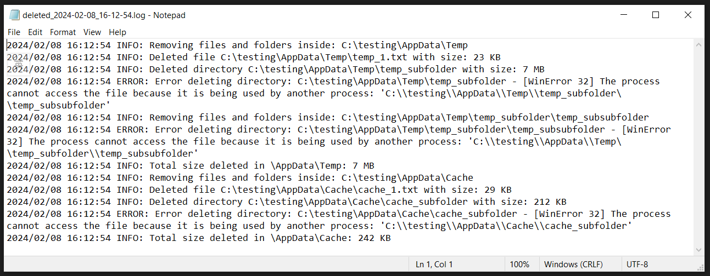

## Logs cleaning automation

### Table of contents

- [Description](#description)
- [Setup](#setup)
- [Usage](#usage)
- [Output Example](#output_example)
- [Files and Directories](#files)
- [Remarks](#remarks)


### <div id="description">Description</div>
This repository aims to automate the cleaning process from VM/local machine according to the user configured input. A log will be saved, logging the time of deletion, name and size of the files/directories that are deleted, as well as any error encountered during the cleaning process. The total size that are cleaned will be also logged.


### <div id="setup">Setup</div>
- Clone this project to the local directory.
- Create a virtual environment and import the [environment](requirement.txt) for this project. 

    ```ps
    pip install virtualenv
    cd [project directory]
    [path to python.exe] -m venv .venv
    ```

- Configure the *master_path* and *delete_folder_str_list* in config.json. *delete_folder_str_list*:
    - *master_path*: the absolute path where the cleaning process begin, multuple master_path declaration could be done by appending json in the list
    - *delete_folder_str_list*: the file structure under *master_path* that needs to be deleted
- Configure the logs directory and file name for logging the deleted files and directories by editing *log_path* and *log_name* in config.ini.
    - *log_path*: the absolute path where the log is saved
    - *log_name*: the log file name
    

### <div id="usage">Usage</div>
- Run the main.py in the environment manually or
- Create a batch script and schedule it on Task Scheduler. Examples of the file and be found [here](main.bat).


### <div id="output_example">Output Example</div>


### <div id="files">Files and Directories</div>
- **image**: image folder
- **logs**: examples output of log file
- **testing**: example folder for testing the script
- **config.init** and **config.json**: user configuration file
- **requirement.txt**: environment file
- **clean.py**: modules
- **main.py**: main python scripts
- **main.bat**: examples batch files


### <div id="remarks">Remarks</div>
- Permission might need to be granted for cleaning in certain directories.